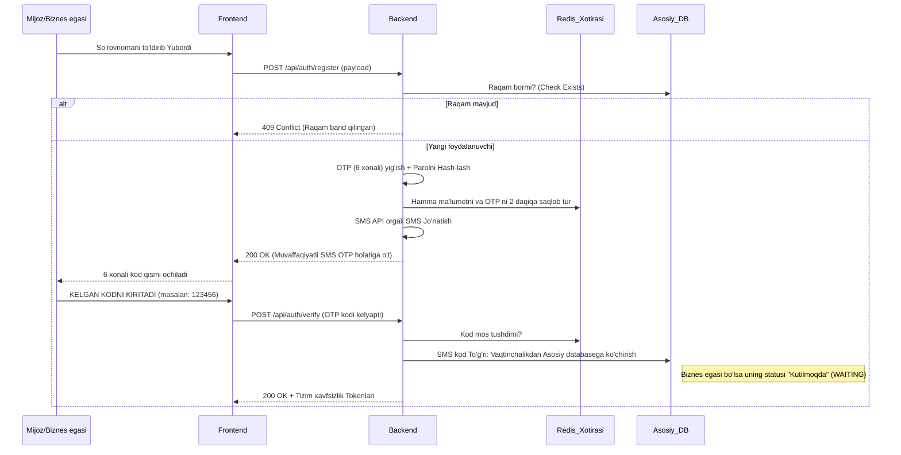

# Autentifikatsiya va Ro'yxatdan o'tish Arxitekturasi (Eng yaxshi amaliyotlar)

> [!NOTE]
> Ushbu hujjat "Yaqin" platformasi uchun xavfsiz, oson kengayadigan va foydalanuvchilar uchun qulay bo'lgan Frontend (React) va Backend tizimlarini to'g'ri bog'lash ko'rsatmalarini o'z ichiga oladi.

## 1. Foydalanuvchi Ssenariylari (Ro'yxatdan o'tish va Kirish)

### Ssenariy A: Mijozning ro'yxatdan o'tishi
1. **1-bosqich (Ma'lumotlarni kiritish)**: Mijoz Frontend orqali `Ism`, `Telefon raqam` va `Parol` kiritadi.
2. **Frontend tekshiruvi (Validation)**: Parol kamida 6 ta belgi ekanligini va raqam to'g'ri ekanligini Frontend oldindan tekshiradi.
3. **So'rov yuborish (API)**: Barcha ma'lumotlar Backend ga POST so'rovi (masalan: `/api/auth/register-client`) orqali yuboriladi.
4. **Backend SMS mantiq**: 
   - Backend birinchi navbatda bu raqam bazada yoxud ro'yxatdan o'tmaganligini tekshiradi.
   - Parol darhol HASH (masalan: bcrypt) qilinishi kerak.
   - Tasodifiy 6 xonali SMS kod (OTP) yaratiladi va u **faqatgina Backend (masalan Redis da 3 daqiqaga)** saqlab qo'yiladi.
   - Kiritilgan barcha `Ism, Parol, Telefon` ma'lumotlari ham to'liq tasdiqdan o'tmagunicha faqat `Redis` kabi vaqtinchalik xotirada saqlanadi (Asosiy DB jadvallarga yozilmaydi).
   - Backend SMS-provayderga ulanib telefonga SMS yuboradi va Frontend ga `200 OK` (SMS ketdi) deb javob qaytaradi.
5. **2-bosqich (SMS Kodini Kiritish - FRONTEND)**: Mijoz telefoniga kelgan kodni kiritish sahnasiga o'tadi. U oynada parolni yoki haqiqiy kodni bilmaydi.
6. **Kod tekshiruvi (BACKEND)**: 
   - Mijoz raqamlarni terib tasdiqlashni bosganda, 6 xonali kod Backend ga tekshirish uchun yuboriladi (`/api/auth/verify-otp`).
   - **Muhim Qoida**: SMS kod hech qachon Frontend da tekshirilmaydi. Backend uni saqlangan kod bilan solishtiradi.
   - Kod to'g'ri bo'lsa, vaqtinchalik xotiradagi (Redis) ma'lumotlar olinib, Asosiy DB `Users` jadvaliga saqlanadi va unga tizimga kirish uchun JWT Tokenlar beriladi.

### Ssenariy B: Biznes Egasining ro'yxatdan o'tishi va Tasdiqlanishi (Approval Flow)
1. **1-bosqich (Kengaytirilgan ma'lumotlar)**: Biznes egasi ro'yxatdan o'tish uchun o'zining asosiy ma'lumotlarini (`Telefon raqam`, `Parol`), hamda biznesi haqidagi boshlang'ich ma'lumotlarni (`Kategoriya main`, `Kategoriya sub`, `Biznes Nomi`, `Manzil`) Frontend da kiritadi va Yuborish tugmasini bosadi.
2. **Backend va SMS qismi**: Jarayon xuddi Mijozniki kabi davom etadi. Kod vaqtinchalik xotirada ushlanib, foydalanuvchiga 6 xonali SMS yuboriladi.
3. **SMS Kodini Tekshirish**: Biznes egasi kodni tasdiqlagach, u Asosiy bazaga yoziladi (`Users` va `Businesses` jadvallari). 
4. **Kutilish holati (Pending Status)**: OTP tasdiqdan o'tib tizim bazasiga yozilgan biznesning boshlang'ich statusi darhol **"Kutilmoqda" (WAITING/PENDING)** bo'ladi.
   - U platformada aktiv hizmat ko'rsatuvchi sifatida ko'rinmaydi. Mijozlar qidiruvida chiqmaydi.
5. **Portfolioni to'ldirish va Aktivlashtirish**: 
   - Biznes egasi endi shaxsiy kabinetiga (Profiliga) kirib huddi "Qorlama" shaklida turgan biznesiga yangi rasmlar, to'liq ish vaqti, qulayliklar va xizmatlarni qo'shib to'ldiradi.
   - Hamma joyi sozlangach "Adminga Tasdiqlash uchun yuborish" tugmasini bosadi.
   - **Admin boshqaruv paneli (Admin panel)** orqali biznesni ko'rib chiqib "Tasdiqlash" tugmasini bossagina, biznesning joriy holati **"Aktiv" (ACTIVE)** ga o'zgaradi va hamma unga bron qilishni boshlay oladi.

> [!CAUTION]
> Biznes aktiv bo'lmaguncha unga onlayn bron yozish tizimi (Booking API) yopib qo'yilishi yoki xato qaytarishi shart.  

### Ssenariy C: Kirish (Login)
1. Foydalanuvchi `Telefon raqam` va `Parol` ni kiritadi.
2. API ga (parol bilan) login so'rovi yuboriladi. Login qilishda hech qanday qimmat pullik SMS yuborish shart emas! Tizim parolni hash bilan solishtirib to'g'ri bo'lsa kirgizib yuboradi.

---

## 2. Frontend Eng Yaxshi Amaliyotlari (UX bo'yicha)

> [!TIP]
> Foydalanuvchi oynasi tez, tushunarli bo'lishi lozim. Qanchalik kam asabni buzadigan bo'lsa shunchalik platformaga kirishlar soni oshadi.

- **Raqam niqobi (Mask)**: Telefon kiritish faqat bitta standartda o'tishi (`+998 XX XXX XX XX`) doim kontrol qilinishi va faqat raqamli kalitlar bilan yuborilishi (`998901234567`) shart.
- **Xatoliklar**: `Parol noto'g'ri` yoki `Bunday foydalanuvchi mavjud emas` degan matnlar serverdan doim izoh formatida kelishi va alert o'rniga zamonaviy Toast/Snackbar orqali ko'rsatilishi kerak.

---

## 3. Backend Eng Yaxshi Amaliyotlari va Xavfsizlik

> [!IMPORTANT]
> Frontend tekshiruvlariga hech qachon 100% ishonmang. Ma'lumot bazaga kirmasdan avval API barcha xavfsizlik va Validatsiya ishlarini o'tkazishi kerak.

### SMS va OTP Mantiqi qanday bo'lishi kerak?
- **6-Xonali kod HIKOYASI**: Hech qachon, hech qanday holatda, yuborilayotgan OTP kod API response orqali Frontend ga "mana bu SMS ketdi" deb jo'natilmasligi shart. Badniyatli hackerlar Chrome "Network" orqali javobni o'qib telefon raqamsiz kodni tasdiqlab o'tib ketishi mumkin!
-  **Rate Limiting (Sekinlashtirish)**: Bitta IP manzil yoki Telefon raqam kuniga SMS geytveyga maksimal X marotaba (masalan har bir minutda atigi 1 yoki kompyuter bo'lsa umuman cheklash) so'rov berolishi (SMS Bomb attack) hisobga olinib yopilishi kerak.

### Ma'lumotlarni saqlash va Tokenlar
- JWT Token qisqa hayot tsikliga ega bo'lishi, (Access Token = 15 minut, Refresh Token = 30 kun cookie orqali).
- Parol albatta BCrypt (Cost=10) yoki undan yuqori algoritm blan HASH holatida saqlanadi. 

---

## 4. Arxitektura Diagrammasi

